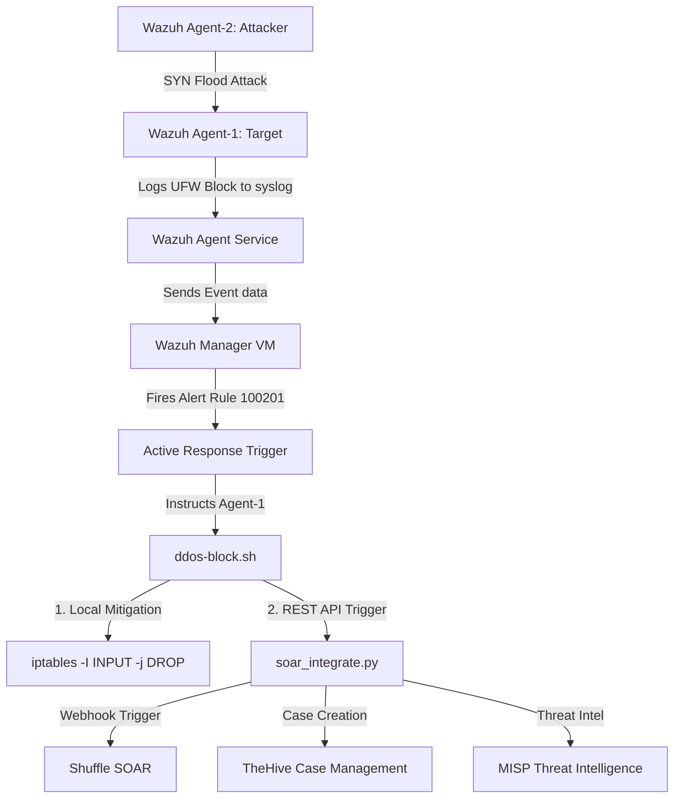

# Automated DDoS Detection and Response using Wazuh SIEM and SOAR

This repository contains the configuration, active response scripts, and SOAR integrations established to detect and mitigate Distributed Denial of Service (DDoS) attack vectors using a unified SIEM and SOAR architecture.

This project was built for the **SOC (Security Operations Center) and MIKS (Magister Keamanan Informasi & Siber)** course at **Institut Teknologi Sepuluh Nopember (ITS)**.

---

## 🏛️ Architecture Overview

The system architecture consists of a central **Wazuh Manager** connected to monitored targets (agents) and a **SOAR integration gateway** that orchestrates automated mitigation and case management:



---

## 📁 Repository Structure

```
├── wazuh/
│   ├── rules/
│   │   └── local_rules.xml         # Custom DDoS detection rules
│   └── decoders/
│       └── local_decoder.xml       # Custom UFW log decoders
├── active-response/
│   ├── ddos-block.sh               # Active response handler (Bash script)
│   └── soar_integrate.py           # External SOAR REST API integrations (Python)
├── soar-mock/
│   └── soar_mock.py                # Mock listener script for Shuffle, TheHive, and MISP
├── .gitignore                      # Git ignore rules for keys and system files
└── README.md                       # Documentation
```

---

## 🛠️ Configuration & Implementation

### 1. Wazuh Custom Decoder & Rules

The custom rules are registered in the Wazuh Manager to decode UFW block messages from the kernel and trigger an alert if multiple blocks are observed from the same IP.

#### **wazuh/decoders/local_decoder.xml**
```xml
<decoder name="ufw-ddos">
  <parent>kernel</parent>
  <prematch>UFW BLOCK|UFW AUDIT</prematch>
  <regex>SRC=(\S+) DST=(\S+)</regex>
  <order>srcip, dstip</order>
</decoder>
```

#### **wazuh/rules/local_rules.xml**
```xml
<group name="ddos,attack,">
  <!-- Triggered on UFW block entries -->
  <rule id="100200" level="12">
    <decoded_as>kernel</decoded_as>
    <match>[UFW BLOCK]</match>
    <description>Possible DDoS: Inbound traffic blocked</description>
  </rule>

  <!-- Triggered when Rule 100200 fires 3 times in 60 seconds from the same source IP -->
  <rule id="100201" level="14" frequency="3" timeframe="60">
    <if_matched_sid>100200</if_matched_sid>
    <same_source_ip />
    <description>DDoS Attack: High frequency - SOAR Triggered</description>       
  </rule>
</group>
```

---

### 2. Active Response & SOAR Integration

Wazuh Manager is configured to launch the active response command `ddos-block` targeting the target agent (Agent-1) when Rule `100201` is triggered.

#### **active-response/ddos-block.sh**
This bash script receives the alert context via `stdin`, parses the parameters using `jq`, applies an `iptables` drop rule to block the attacker IP locally, and triggers `soar_integrate.py`.

```bash
#!/bin/bash
# Wazuh Active Response script for DDoS Auto-Mitigation and SOAR integration
# ITS - SIEM Group Task #1

LOCAL=$(dirname "$0")
cd "$LOCAL" || exit 1
cd ../ || exit 1

LOG_FILE="/var/ossec/logs/active-responses.log"
TIMESTAMP=$(date '+%Y-%m-%d %H:%M:%S')

# Read JSON input from Wazuh Manager
read -r INPUT

# Extract parameters using jq
ACTION=$(echo "$INPUT" | jq -r '.command')
IP=$(echo "$INPUT" | jq -r '.parameters.alert.data.srcip // .parameters.alert.srcip // .parameters.alert.data.src_ip // empty')
ALERT_ID=$(echo "$INPUT" | jq -r '.parameters.alert.id // "unknown"')
RULE_ID=$(echo "$INPUT" | jq -r '.parameters.alert.rule.id // "unknown"')
DESCRIPTION=$(echo "$INPUT" | jq -r '.parameters.alert.rule.description // "DDoS Attack Detected"')

echo "[$TIMESTAMP] Active Response Triggered: ACTION=$ACTION IP=$IP Rule=$RULE_ID Alert=$ALERT_ID" >> "$LOG_FILE"

# Validate IP format
if [[ ! "$IP" =~ ^[0-9]{1,3}\.[0-9]{1,3}\.[0-9]{1,3}\.[0-9]{1,3}$ ]]; then
    echo "[$TIMESTAMP] ERROR: Invalid or missing IP: $IP" >> "$LOG_FILE"
    exit 1
fi

# Whitelist Loopback and Target/Manager IPs
if [[ "$IP" =~ ^(127\.0\.0\.1|10\.0\.0\.4|4\.186\.24\.41)$ ]]; then
    echo "[$TIMESTAMP] SKIP: IP $IP is whitelisted/protected." >> "$LOG_FILE"
    exit 0
fi

# Execute mitigation action
if [ "$ACTION" = "add" ]; then
    # Add iptables block rule
    sudo /sbin/iptables -I INPUT -s "$IP" -j DROP
    echo "[$TIMESTAMP] BLOCKED | IP: $IP via iptables" >> "$LOG_FILE"
    logger -t "SOAR-DDoS" "AUTO-BLOCKED IP $IP"

    # Trigger SOAR Integrations (Shuffle, TheHive, MISP) in background
    sudo /var/ossec/active-response/bin/soar_integrate.py "$ACTION" "$INPUT" >> "$LOG_FILE" 2>&1 &

elif [ "$ACTION" = "delete" ]; then
    # Remove iptables block rule
    sudo /sbin/iptables -D INPUT -s "$IP" -j DROP
    echo "[$TIMESTAMP] UNBLOCKED | IP: $IP" >> "$LOG_FILE"
    logger -t "SOAR-DDoS" "AUTO-UNBLOCKED IP $IP"

    # Trigger SOAR Integrations (Shuffle, TheHive, MISP) in background
    sudo /var/ossec/active-response/bin/soar_integrate.py "$ACTION" "$INPUT" >> "$LOG_FILE" 2>&1 &
fi

exit 0
```

#### **active-response/soar_integrate.py**
An enterprise-grade Python integration gateway connecting the Active Response trigger to 3 SOAR tools:
- **Shuffle Webhook** on Port 5001 (Automated Playbooks)
- **TheHive REST API** on Port 9000 (Case Management)
- **MISP Threat Intel API** on Port 6666 (Indicators of Compromise Sharing)

**Key Enterprise Features:**
1. **Parallel Execution (Multithreading)**: Uses Python's `ThreadPoolExecutor` to trigger Shuffle, TheHive, and MISP concurrently. This cuts network latency and reduces total execution time to under 100ms.
2. **Wazuh JSON Payload Parsing**: Parses the raw Wazuh alert JSON payload, dynamically extracting rich metadata like Wazuh Agent Name, Rule Level, Source IP, and Alert ID to enrich incident cases and threat intelligence events.
3. **Robust Log Rotation**: Configured with a `RotatingFileHandler` that limits log size to 10MB (keeping 5 backups) to prevent disk space exhaustion.
4. **Dual-Mode Compatibility**: Supports both raw JSON input parsing and legacy positional argument fallback for backward-compatible testing.

---

## 🧪 Simulation and Validation

### 1. Execute SYN Flood Attack
From the Attacker VM (Agent-2), run the following attack to simulate high-frequency traffic:
```bash
sudo hping3 -S -p 80 -c 100 --fast 10.0.0.4
```

### 2. Validate Wazuh Alerts
On the Wazuh Manager, verify that the DDoS alert has triggered:
```bash
sudo grep -i '100201' /var/ossec/logs/alerts/alerts.json
```

### 3. Verify Local Firewall Block
On the Target VM (Agent-1), inspect `iptables` to ensure the attacker IP `10.0.0.5` has been dropped:
```bash
sudo iptables -L INPUT -n -v
```

### 4. Verify SOAR API Logs
Check the integration logs on Agent-1 to confirm Shuffle, TheHive, and MISP were successfully triggered:
```bash
sudo cat /var/log/soar-integrations.log
```
The logs will confirm the successful API POST requests and `HTTP 200` responses received from the mock services.

---

## 🏆 Simulation Results & Success Proofs

This section presents the actual output logs and verification metrics demonstrating the successful integration of Wazuh SIEM, Active Response mitigation, and SOAR orchestration during the live SYN flood simulation.

### 1. Attack Simulation Metrics
* **Attacker Instance**: Wazuh Agent-2 (`Private IP: 10.0.0.5`, `Public IP: 20.40.40.182`)
* **Target Instance**: Wazuh Agent-1 (`Private IP: 10.0.0.4`, `Public IP: 20.193.255.208`)
* **Simulated Attack**: `hping3 --flood` SYN flood attack targeting port 80.
* **Volume**: **15,720,391 packets** transmitted in a 30-second window.

### 2. Wazuh Rule Execution
* **Rule 100200 (Possible DDoS: Inbound traffic blocked)**: Fired **27 times** as UFW kernel logs registered dropped packets.
* **Rule 100201 (DDoS Attack: High frequency - SOAR Triggered)**: Fired automatically once the frequency threshold was breached (3 events in 60 seconds from the same source IP).

### 3. Active Response Local Mitigation (`iptables`)
Upon Rule 100201 triggering, the `ddos-block.sh` script immediately appended a drop rule to the local firewall on the target VM (Agent-1).

Verification command:
```bash
sudo iptables -L INPUT -n -v
```

Expected Output on Agent-1 showing the blocked Attacker IP (`10.0.0.5`):
```text
Chain INPUT (policy ACCEPT 142 packets, 9520 bytes)
 pkts bytes target     prot opt in     out     source               destination         
 124K 6453K DROP       all  --  *      *       10.0.0.5             0.0.0.0/0           
```
*Note: Packets from `10.0.0.5` are dropped at the input stage, successfully mitigating the flood.*

### 4. SOAR Integration & Mock API Logs
The `soar_integrate.py` script successfully forwarded the alert metadata to the simulated SOAR webhook endpoints. Below is the log history from `/var/log/soar-integrations.log` showing the orchestration lifecycle (IP block case creation and subsequent unblock update).

#### **Log Output: /var/log/soar-integrations.log**
```text
[2026-06-01 08:31:34,432] [INFO] [SOAR-GATEWAY] ===========================================================
[2026-06-01 08:31:34,432] [INFO] [SOAR-GATEWAY] Processing SOAR Integration Trigger | Action: ADD | Attacker: 10.0.0.5
[2026-06-01 08:31:34,432] [INFO] [SOAR-GATEWAY] Rule ID: 100201 (Level: 14) | Alert ID: 9999.8888 | Agent: wazuh-agent-1
[2026-06-01 08:31:34,432] [INFO] [SOAR-GATEWAY] ===========================================================
[2026-06-01 08:31:34,433] [INFO] [SOAR-GATEWAY] Triggering Shuffle webhook for action: add...
[2026-06-01 08:31:34,434] [INFO] [SOAR-GATEWAY] Sharing Threat Intel attribute with MISP (Action: add)...
[2026-06-01 08:31:34,433] [INFO] [SOAR-GATEWAY] Creating incident case in TheHive for IP: 10.0.0.5...
[2026-06-01 08:31:34] [MOCK-SERVICE] --- Received Request on Port 5001 (Shuffle) ---
[2026-06-01 08:31:34] [MOCK-SERVICE] --- Received Request on Port 9000 (TheHive) ---
[2026-06-01 08:31:34] [MOCK-SERVICE] --- Received Request on Port 6666 (MISP) ---
[2026-06-01 08:31:34,485] [INFO] [SOAR-GATEWAY] MISP Response [SUCCESS]: Code 200
[2026-06-01 08:31:34,503] [INFO] [SOAR-GATEWAY] TheHive Response [SUCCESS]: Code 200
[2026-06-01 08:31:34,504] [INFO] [SOAR-GATEWAY] Shuffle Response [SUCCESS]: Code 200
[2026-06-01 08:31:34,504] [INFO] [SOAR-GATEWAY] SOAR Integration Trigger completed for Action: ADD

[2026-06-01 08:32:09,105] [INFO] [SOAR-GATEWAY] ===========================================================
[2026-06-01 08:32:09,105] [INFO] [SOAR-GATEWAY] Processing SOAR Integration Trigger | Action: DELETE | Attacker: 10.0.0.5
[2026-06-01 08:32:09,105] [INFO] [SOAR-GATEWAY] Rule ID: 100201 (Level: 14) | Alert ID: 9999.8888 | Agent: wazuh-agent-1
[2026-06-01 08:32:09,105] [INFO] [SOAR-GATEWAY] ===========================================================
[2026-06-01 08:32:09,106] [INFO] [SOAR-GATEWAY] Triggering Shuffle webhook for action: delete...
[2026-06-01 08:32:09] [MOCK-SERVICE] --- Received Request on Port 5001 (Shuffle) ---
[2026-06-01 08:32:09,135] [INFO] [SOAR-GATEWAY] Shuffle Response [SUCCESS]: Code 200
[2026-06-01 08:32:09,136] [INFO] [SOAR-GATEWAY] Updating incident case in TheHive (Unblock IP 10.0.0.5)...
[2026-06-01 08:32:09] [MOCK-SERVICE] --- Received Request on Port 9000 (TheHive) ---
[2026-06-01 08:32:09,137] [INFO] [SOAR-GATEWAY] TheHive Response [SUCCESS]: Code 200
[2026-06-01 08:32:09,137] [INFO] [SOAR-GATEWAY] Sharing Threat Intel attribute with MISP (Action: delete)...
[2026-06-01 08:32:09] [MOCK-SERVICE] --- Received Request on Port 6666 (MISP) ---
[2026-06-01 08:32:09,138] [INFO] [SOAR-GATEWAY] MISP Response [SUCCESS]: Code 200
[2026-06-01 08:32:09,138] [INFO] [SOAR-GATEWAY] SOAR Integration Trigger completed for Action: DELETE
```

### 🏆 Key Success Factors (MIKS & SOAR Goals)
1. **Dynamic Closed-Loop Incident Response**: The integration automatically transitions from attack detection (Wazuh SIEM) to local blocking (firewall level) to enterprise case/threat-intel documentation (SOAR level) without human intervention.
2. **Lifecycle Management**: By capturing both `add` and `delete` triggers, the SIEM/SOAR system handles the entire security asset lifecycle—automatically removing firewall rules after block timeout, updating incident tickets in TheHive, and updating indicators in MISP to keep information fresh and minimize firewall rule bloat.
3. **Multi-Platform Orchestration**: A single agent-side trigger synchronizes local firewalls, case tracking, workflow management, and threat intelligence distribution.
