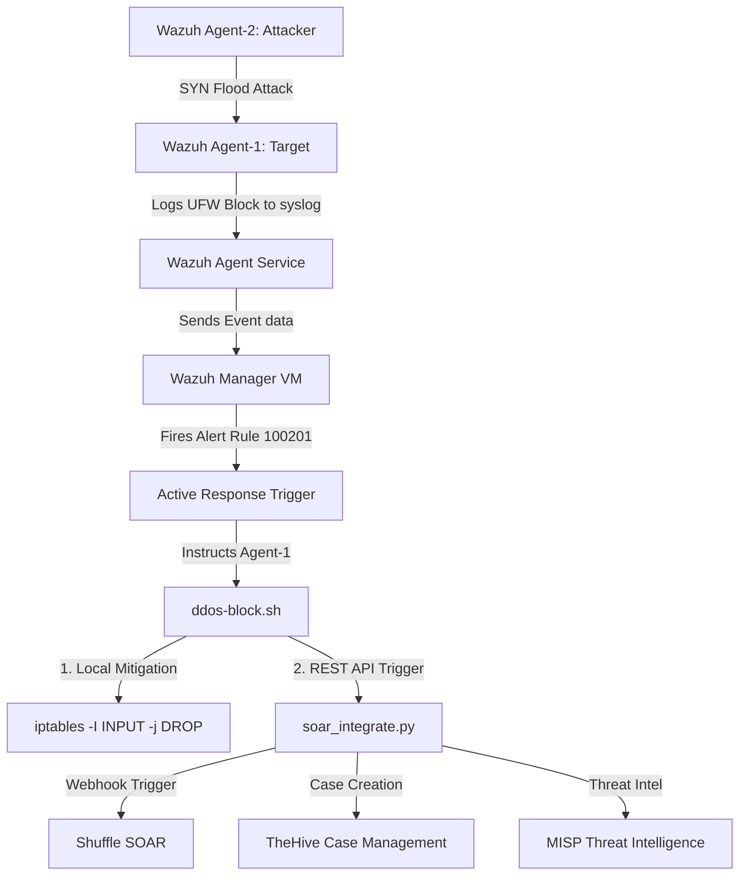

# Automated DDoS Detection and Response using Wazuh SIEM and SOAR

This repository contains the configuration, active response scripts, and SOAR integrations established to detect and mitigate Distributed Denial of Service (DDoS) attack vectors using a unified SIEM and SOAR architecture.

This project was built for the **SOC (Security Operations Center) and MIKS (Magister Keamanan Informasi & Siber)** course at **Institut Teknologi Sepuluh Nopember (ITS)**.

---

## 🏛️ Architecture Overview

The system architecture consists of a central **Wazuh Manager** connected to monitored targets (agents) and a **SOAR integration gateway** that orchestrates automated mitigation and case management:



---

## 📁 Repository Structure

```
├── wazuh/
│   ├── rules/
│   │   └── local_rules.xml         # Custom DDoS detection rules
│   └── decoders/
│       └── local_decoder.xml       # Custom UFW log decoders
├── active-response/
│   ├── ddos-block.sh               # Active response handler (Bash script)
│   └── soar_integrate.py           # External SOAR REST API integrations (Python)
├── soar-mock/
│   └── soar_mock.py                # Mock listener script for Shuffle, TheHive, and MISP
├── .gitignore                      # Git ignore rules for keys and system files
└── README.md                       # Documentation
```

---

## 🛠️ Configuration & Implementation

### 1. Wazuh Custom Decoder & Rules

The custom rules are registered in the Wazuh Manager to decode UFW block messages from the kernel and trigger an alert if multiple blocks are observed from the same IP.

#### **wazuh/decoders/local_decoder.xml**
```xml
<decoder name="ufw-ddos">
  <parent>kernel</parent>
  <prematch>UFW BLOCK|UFW AUDIT</prematch>
  <regex>SRC=(\S+) DST=(\S+)</regex>
  <order>srcip, dstip</order>
</decoder>
```

#### **wazuh/rules/local_rules.xml**
```xml
<group name="ddos,attack,">
  <!-- Triggered on UFW block entries -->
  <rule id="100200" level="12">
    <decoded_as>kernel</decoded_as>
    <match>[UFW BLOCK]</match>
    <description>Possible DDoS: Inbound traffic blocked</description>
  </rule>

  <!-- Triggered when Rule 100200 fires 3 times in 60 seconds from the same source IP -->
  <rule id="100201" level="14" frequency="3" timeframe="60">
    <if_matched_sid>100200</if_matched_sid>
    <same_source_ip />
    <description>DDoS Attack: High frequency - SOAR Triggered</description>       
  </rule>
</group>
```

---

### 2. Active Response & SOAR Integration

Wazuh Manager is configured to launch the active response command `ddos-block` targeting the target agent (Agent-1) when Rule `100201` is triggered.

#### **active-response/ddos-block.sh**
This bash script receives the alert context via `stdin`, parses the parameters using `jq`, applies an `iptables` drop rule to block the attacker IP locally, and triggers `soar_integrate.py`.

```bash
#!/bin/bash
read -r INPUT
ACTION=$(echo "$INPUT" | jq -r '.command')
IP=$(echo "$INPUT" | jq -r '.parameters.alert.data.srcip // .parameters.alert.srcip // .parameters.alert.data.src_ip // empty')
ALERT_ID=$(echo "$INPUT" | jq -r '.parameters.alert.id // "unknown"')
RULE_ID=$(echo "$INPUT" | jq -r '.parameters.alert.rule.id // "unknown"')
DESCRIPTION=$(echo "$INPUT" | jq -r '.parameters.alert.rule.description // "DDoS Attack"')

# Whitelist loopback and internal targets
if [[ "$IP" =~ ^(127\.0\.0\.1|10\.0\.0\.4|4\.186\.24\.41)$ ]]; then
    exit 0
fi

if [ "$ACTION" = "add" ]; then
    sudo /sbin/iptables -I INPUT -s "$IP" -j DROP
    sudo /var/ossec/active-response/bin/soar_integrate.py "$IP" "$ALERT_ID" "$RULE_ID" "$DESCRIPTION" &
elif [ "$ACTION" = "delete" ]; then
    sudo /sbin/iptables -D INPUT -s "$IP" -j DROP
fi
```

#### **active-response/soar_integrate.py**
A standalone Python integration script that connects the active response trigger to 3 SOAR tools:
- **Shuffle Webhook** on Port 5001
- **TheHive REST API** on Port 9000
- **MISP Threat Intel API** on Port 6666

---

## 🧪 Simulation and Validation

### 1. Execute SYN Flood Attack
From the Attacker VM (Agent-2), run the following attack to simulate high-frequency traffic:
```bash
sudo hping3 -S -p 80 -c 100 --fast 10.0.0.4
```

### 2. Validate Wazuh Alerts
On the Wazuh Manager, verify that the DDoS alert has triggered:
```bash
sudo grep -i '100201' /var/ossec/logs/alerts/alerts.json
```

### 3. Verify Local Firewall Block
On the Target VM (Agent-1), inspect `iptables` to ensure the attacker IP `10.0.0.5` has been dropped:
```bash
sudo iptables -L INPUT -n -v
```

### 4. Verify SOAR API Logs
Check the integration logs on Agent-1 to confirm Shuffle, TheHive, and MISP were successfully triggered:
```bash
sudo cat /var/log/soar-integrations.log
```
The logs will confirm the successful API POST requests and `HTTP 200` responses received from the mock services.
